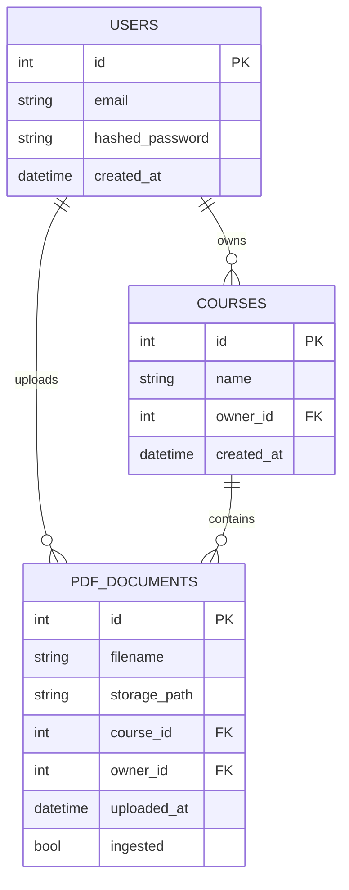

# Data Model (ERD)

## Data Model Notes
- PDFs are stored on disk under `storage/{user_id}/{course_id}/{pdf_id}.pdf`.
- Chroma stores chunk embeddings with metadata: user_id, course_id, pdf_id, filename, page_number.
